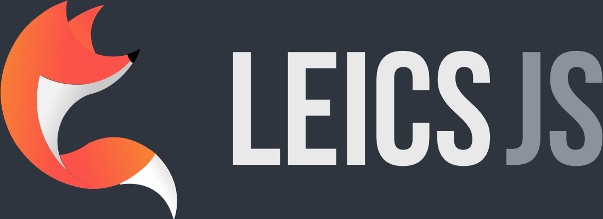

<div align="center">
	
	<h1><b>🦊 LeicesterJS Website</b></h1>
	<p><b>The Official LeicesterJS Website - See it Live at <a href="https://leicesterjs.org">https://leicesterjs.org</a></b></p>
	</br>
	</br>
</div>

## 👩‍💻 Getting Started

First clone the project

`$ git clone https://github.com/leicesterjs/site leicesterjs-site`

Next install the dependencies and run the project.
`$ npm install && npm run dev`

When you make changes to the code, the blog will automatically update via BrowserSync.

## 👥 Creating a new Meetup

To create a new meetup based on the official meetup contained on https://meetup.com/leicesterjs, first create a dated markdown file in `/src/meetups`
The format of the date should be in [ISO_8601](https://en.wikipedia.org/wiki/ISO_8601) which looks like this `yyyy-mm-dd hh:mm:ss`. Note: you will need to account for whether or not the meetup is taking place during BST and alter the date format to be in UTC without the timezone offset e.g. `2019-08-15 19:00:00+01:00` would become `2019-08-15 18:00:00`.

Inside this file create a template similar to the below

```
---
layout: meetups
location: CloudCall, 1 Colton Square, LE1 1QH, Leicester
started_at: 2019-08-15 18:00:00
ended_at: 2019-08-15 19:30:00
tags: meetups
talks:
  - speaker: Joshua Graham,
    title: A mostly non technical talk about building software
  - speaker: Richard Birley,
    title: Component based design with Figma
title: LeicesterJS - August Meetup - Design & Non-Technical
meetup_id: 263567706
---
```

You can find the `meetup_id` in the URL of the Meetup in question. For the above the URL is `https://www.meetup.com/leicesterjs/events/263567706/`
The end part is the Id you need.

After you have written the article, submit a new [Pull Request](https://github.com/osdc/blog/pull/new/master).

## Technologies

- Built using Eleventy (11ty)
- Hosted on Netlify

<div align="center">
	<br>
  <p>Made with ❤️ by the lovely attendants of LeicesterJS</p>
  <br>
</div>
